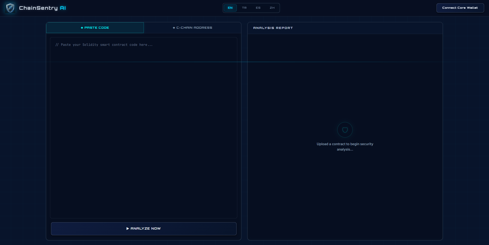
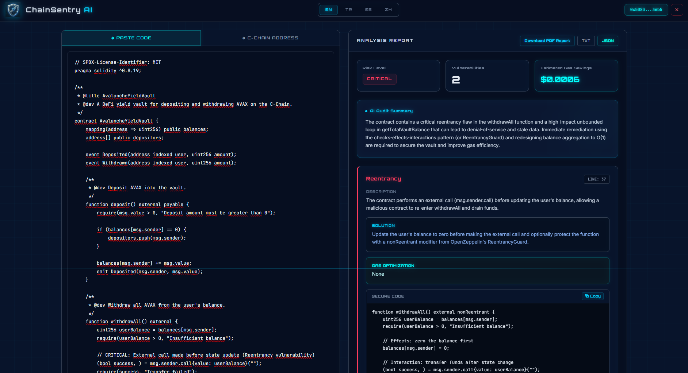

<div align="center">
  
  <h1>ChainSentry AI</h1>
  <p><strong>Next-Generation Smart Contract Security Auditor for the Avalanche Ecosystem</strong></p>

  <!-- Badges -->
  <p>
    
    
    
    
  </p>
</div>

<br/>

<div align="center">
  
  
</div>

<br/>

## 📖 Project Overview

**ChainSentry AI** is an advanced, AI-driven smart contract vulnerability scanner engineered specifically for the Avalanche network. By combining a powerful local LLM (`gpt-oss:120b-cloud`) with a highly specialized Retrieval-Augmented Generation (RAG) engine, ChainSentry acts as a tireless, senior-level auditor. 

It analyzes Solidity code in real-time to detect logical flaws and security vulnerabilities, translates these bugs into actionable solutions, and calculates the exact economic value of its gas optimizations in USD—setting a new standard for decentralized security tooling.

---

## ✨ Key Features

- 🧠 **RAG-Powered AI Engine**
  Instead of relying on generic LLM weights (which are prone to hallucinating code), ChainSentry leverages a highly curated **FAISS vector database**. This database is pre-loaded with historical hack data spanning the SWC registry, Oracle Manipulation vectors, and Flash Loan exploits, ensuring the AI detects complex, real-world logical flaws with absolute accuracy.

- 💰 **Economic Value with Chainlink**
  Security is also about efficiency. ChainSentry identifies gas optimization opportunities within your contract and correlates them with real-time AVAX price data fetched via **Chainlink Price Feeds**. It explicitly calculates and displays the expected network savings in USD per transaction.

- 🦊 **Native Core Wallet Integration**
  Designed to feel completely native to the Avalanche ecosystem, the platform seamlessly connects to user wallets utilizing raw `window.avalanche` Ethereum provider detection without relying on bulky, third-party modal wrappers.

- 🔍 **Snowtrace Integration**
  Users can instantly audit deployed mainnet/testnet contracts by simply pasting an Avalanche C-Chain address. The backend directly interfaces with the **Snowtrace API** to securely fetch and analyze verified source code.

- 📄 **Executive Smart PDF Reports**
  Exporting audit findings has never been easier. The platform dynamically renders highly-professional, multilingual (EN, TR, ES, ZH) **Smart PDF Audit Reports** using `jsPDF`. Each document features a cyber-auditor aesthetic, a complete vulnerability matrix, and a 2-3 sentence AI-generated Executive Summary tailored for C-Level stakeholders.

---

## 🏗️ Architecture & Tech Stack

Our platform is constructed using modern, scalable, and decentralized frameworks:

### Frontend
- **Framework:** React.js powered by Vite.
- **Styling:** Tailwind CSS with a custom-engineered "Avalanche Cyber-Auditor" semantic theme (Deep Space Navy, Electric Blue, Silver).
- **PDF Generation:** jsPDF & jsPDF-AutoTable.

### Backend
- **Framework:** Python 3.x, FastAPI, Uvicorn.
- **Web3 Interaction:** Web3.py for chain-level interactions.

### AI & Data Engine
- **LLM Runtime:** Ollama (`gpt-oss:120b-cloud`).
- **RAG Architecture:** LangChain, FAISS (CPU), Sentence-Transformers.
- **Embeddings:** HuggingFace `all-MiniLM-L6-v2`.

### Web3 integrations
- **Network:** Avalanche C-Chain (RPCs).
- **Wallet Provider:** Core app (`window.avalanche`).
- **Oracles:** Chainlink Data Feeds.
- **Explorers:** Snowtrace API.

---

## 🚀 Local Setup Instructions

Follow these steps to run ChainSentry AI locally on your machine.

### 1. Backend Setup (Root Directory)

Open your terminal in the project's **root directory**.

1. **Install Python dependencies:**
   ```bash
   pip install -r requirements.txt
   ```

2. **Configure Environment Variables:**
   Create a `.env` file in the root directory and add your Snowtrace API key:
   ```env
   SNOWTRACE_API_KEY=your_snowtrace_api_key_here
   ```

3. **Start the FastAPI Server:**
   ```bash
   python -m uvicorn main:app --reload --host 127.0.0.1 --port 8000
   ```
   *The backend will be available at `http://127.0.0.1:8000`.*

### 2. Frontend Setup (`frontend/` Directory)

Open a new terminal window and navigate to the **`frontend`** folder.

1. **Install Node.js dependencies:**
   ```bash
   cd frontend
   npm install
   ```

2. **Start the Vite Development Server:**
   ```bash
   npm run dev
   ```
   *The frontend will be available at `http://localhost:5173`. Connect your Core Wallet and start auditing!*

---

## 🔮 Vision

**ChainSentry AI** was built for the builders. As the Avalanche ecosystem scales infinitely through Subnets, the demand for decentralized, uncompromising, and deeply intelligent security tooling will skyrocket. Code audits should not be a luxury reserved for post-production—they should be an integral, accessible, and instantaneous part of the developer workflow. 

ChainSentry AI represents that standard. Build boldly, audit effortlessly.

---

## 👥 The Team
- **Sudem** - Co-Founder, AI & Backend Lead
- **Cansu** - Frontend & Web3 Developer
- **Beyza** - Product Manager & QA

## 🎥 See It in Action

▶️ **[Watch the Demo Video Here](https://www.youtube.com/watch?v=UeQ4cAVqIbE)**

## 🏆 Hackathon Tracks & Bounties Targeted
- **Avalanche Core Wallet Integration:** Native wallet connection via `window.avalanche`.
- **Chainlink Price Feeds:** Real-time gas optimization economic metrics (AVAX/USD).
- **Best Use of AI/RAG:** Historical hack detection using FAISS and local LLMs.
